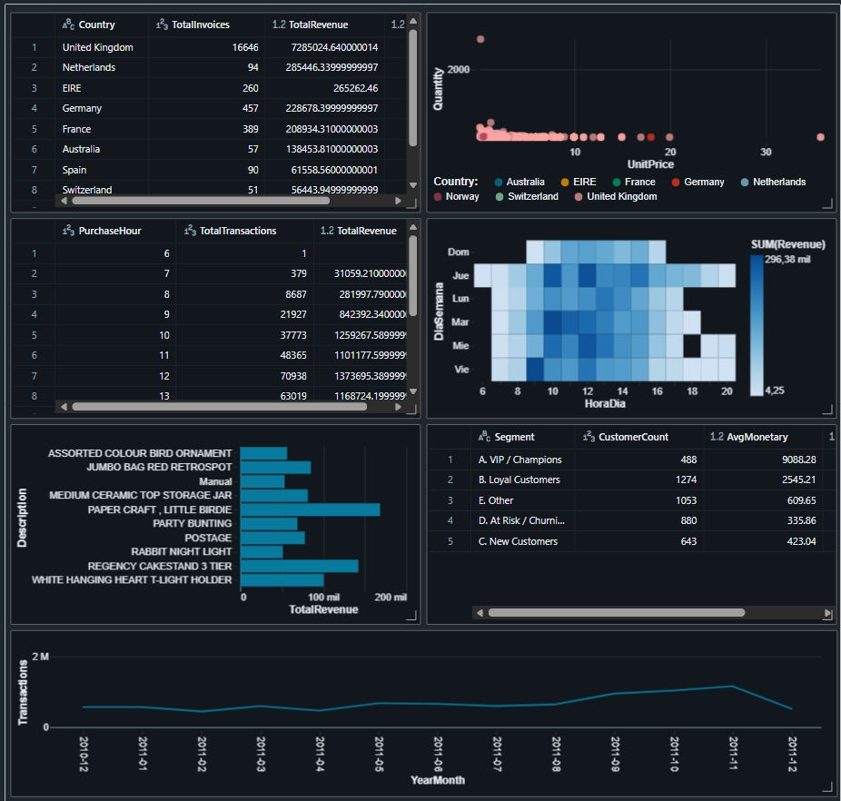
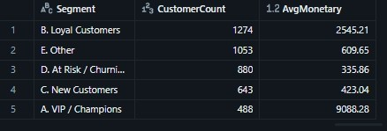
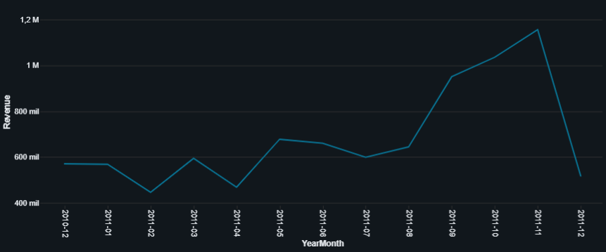

# 🚀 E-Commerce Data Engineering & Analytics (End-to-End)


> **Transformación de datos crudos (~540k transacciones) en estrategia de negocio utilizando PySpark y Databricks en un entorno de Big Data.**

---

## 📊 Executive Dashboard (Resultado Final)

El objetivo principal de este proyecto fue construir un pipeline de datos robusto que alimentara un tablero ejecutivo para la toma de decisiones. El resultado consolida métricas de retención (RFM), tendencias operativas y desempeño de productos.



---

## 💡 Key Business Insights (Resultados del Análisis)

A través de consultas SQL avanzadas y visualización de datos, se extrajeron 4 hallazgos estratégicos de alto impacto:

### 1. El Valor de la Segmentación (Análisis RFM)
Utilizando ingeniería de características avanzada, segmentamos a los usuarios en base a su Recencia, Frecuencia y Valor Monetario.
* **Hallazgo:** El segmento **"VIP / Champions"** (Score 4-4-4) representa una minoría de usuarios pero con un ticket promedio de **~$9,000**, comparado con ~$400 de los clientes nuevos.
* **Estrategia:** La retención de estos 488 clientes VIP es crítica para la estabilidad financiera del negocio.



### 2. Eficiencia Operativa: La "Hora Dorada"
Mapeo de intensidad de transacciones (Heatmap) por día y hora.
* **Hallazgo:** El 80% de la actividad transaccional se concentra de **Lunes a Jueves entre las 10:00 AM y 3:00 PM**.
* **Estrategia:** Programar ventanas de mantenimiento y despliegues técnicos fuera de este horario (ej. 1 AM - 7 AM) para evitar pérdidas de revenue.


### 3. Estacionalidad y Planificación
Análisis de series de tiempo del Revenue mensual.
* **Hallazgo:** Se detectó un crecimiento sostenido con un pico agresivo en **Noviembre** (pre-campaña navideña).
* **Estrategia:** La planificación de stock y logística para Q4 debe cerrarse mandatoriamente en Septiembre para cubrir la demanda.



### 4. Principio de Pareto en Productos
* **Hallazgo:** A pesar de contar con miles de SKUs, el Top 10 de productos genera una parte desproporcionada del ingreso total.
* **Estrategia:** Asegurar disponibilidad 100% (stock de seguridad) para estos 10 productos clave es más prioritario que diversificar el catálogo.


---

## ⚙️ Ingeniería de Datos & Desafíos Técnicos

Este proyecto simuló un entorno de producción real, enfrentando y resolviendo problemas de calidad de datos y compatibilidad de versiones.

### 🛠️ Stack Tecnológico
* **Plataforma:** Databricks Community Edition (Spark 4.0).
* **Procesamiento:** PySpark (DataFrames) para limpieza y optimización.
* **Análisis:** Spark SQL (Window Functions, CTEs) para lógica de negocio.
* **Visualización:** Databricks Dashboards.

### 🔧 Desafíos Superados

#### 1. Inconsistencia de Formatos de Fecha (Spark 4.0)
El dataset presentaba fechas con formatos mixtos (`M/d/yyyy` y `MM/dd/yyyy`) que causaban fallos críticos en el parser estricto de Spark.
* **Solución:** Implementación de lógica `coalesce` con `try_to_timestamp` para manejar excepciones sin detener el pipeline.

```python
# Solución robusta para parsing de fechas
df_cleaned = df_cleaned.withColumn(
    "InvoiceDate",
    F.coalesce(
        F.try_to_timestamp(F.col("InvoiceDate"), F.lit("M/d/yyyy H:m")),
        F.try_to_timestamp(F.col("InvoiceDate"), F.lit("MM/dd/yyyy HH:mm"))
    )
)
